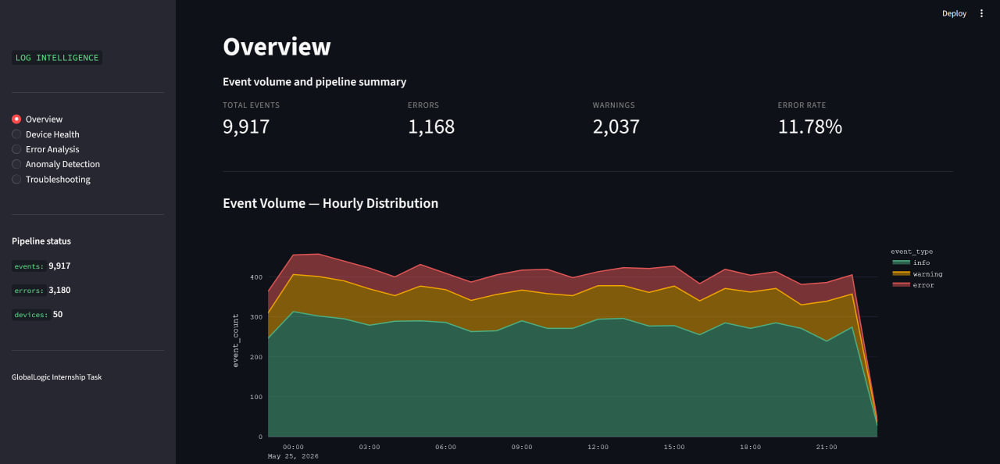
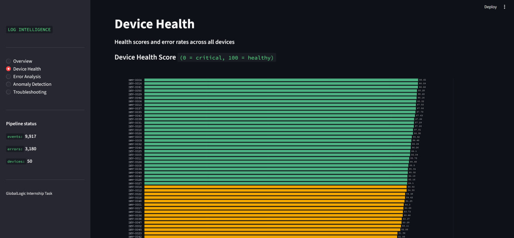
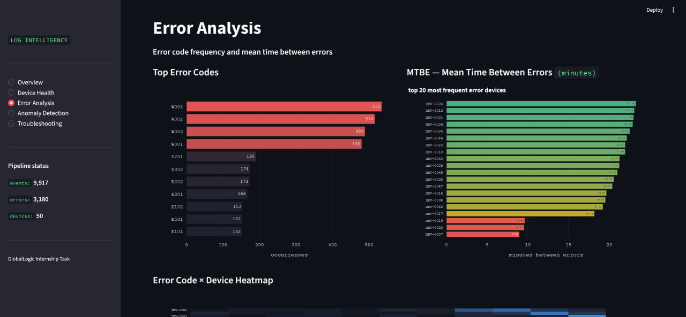
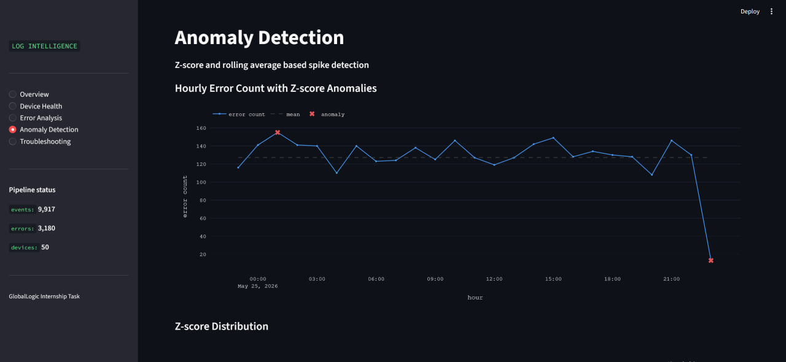
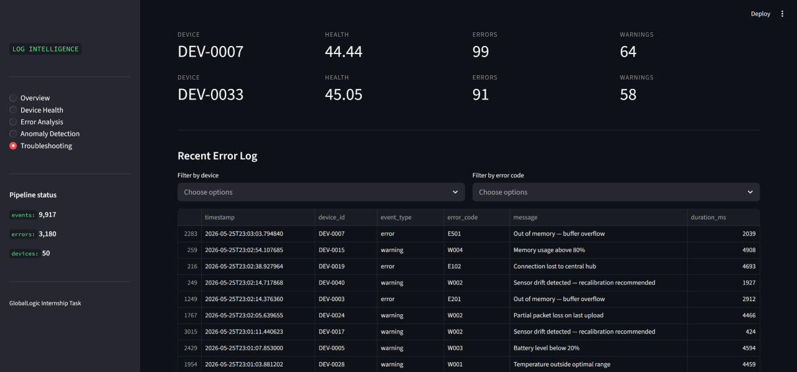

# Log Intelligence Pipeline

A data pipeline that ingests, processes, and analyzes logs from medical devices — transforming raw semi-structured data into actionable metrics and visualizations.

---

## Architecture

```
[Log Generator] → [JSONL raw data] → [ETL Transformer] → [PostgreSQL]
                                                                ↓
                                                      [DuckDB Analytics]
                                                                ↓
                                                     [Anomaly Detection]
                                                                ↓
                                                    [Streamlit Dashboard]

                         [Prefect Orchestration — coordinates all layers]
```

| Layer | Component | File |
|---|---|---|
| Ingestion | Log Generator | `ingestion/log_generator.py` |
| Processing | ETL Transformer | `etl/transformer.py` |
| Storage | PostgreSQL loader | `storage/db_loader.py` |
| Analytics | DuckDB SQL metrics | `analytics/metrics.py` |
| Anomaly Detection | Z-score + Rolling avg | `analytics/anomaly.py` |
| Orchestration | Prefect flow | `orchestration/pipeline_flow.py` |
| Visualization | Streamlit dashboard | `dashboard/app.py` |

---

## Tooling Decisions

| Tool | Role | Justification |
|---|---|---|
| Python | Processing, scripting | Required; industry standard for DE |
| PostgreSQL | Relational storage | Production-grade RDBMS; AWS equivalent: Redshift |
| DuckDB | Analytical queries | Fast columnar analytics on CSV files; AWS equivalent: Athena |
| Prefect | Orchestration | Lightweight DAG orchestration with retries; AWS equivalent: Step Functions |
| Streamlit | Dashboard | Python-native, minimal setup, suitable for analytical workloads |
| Docker Compose | Containerization | Reproducible local environment |
| Faker | Data simulation | Realistic synthetic device log generation |

The solution is cloud-agnostic by design. Each local component maps to an AWS equivalent, making migration to a cloud environment straightforward without architectural changes.

---

## Data Model

```sql
devices   (device_id PK, device_type)
events    (log_id PK, timestamp, device_id FK, event_type, message, duration_ms, status, session_id, firmware)
errors    (log_id PK, timestamp, device_id FK, event_type, error_code, message, duration_ms)
sessions  (session_id PK, device_id FK, firmware, first_seen, last_seen, event_count)
```

Indexes on `timestamp`, `device_id`, `event_type`, and `error_code` for optimized time-based and aggregation queries.

---

## Sample Data

The generator produces 11,000 records per run (10,000 clean + ~10% intentional quality issues):

| Issue type | Rate | Description |
|---|---|---|
| Duplicates | ~5% | Same `log_id`, exact record copy |
| Missing fields | ~3% | Dropped `device_type`, `message`, or `payload` |
| Invalid records | ~2% | Bad timestamp, unknown event type, or null device |

50 simulated medical devices across 8 device types. 3 devices (DEV-0007, DEV-0019, DEV-0033) are flagged as faulty — they generate error spikes detectable by the anomaly detection layer.

---

## Prerequisites

- Python 3.11+
- Docker Desktop
- Git

---

## Setup

**1. Clone the repository**

```bash
git clone <repo-url>
cd pipeline
```

**2. Create `.env` from the example**

```bash
cp .env.example .env
```

Fill in your values:

```
DB_HOST=127.0.0.1
DB_PORT=5433
DB_NAME=log_intelligence
DB_USER=pipeline
DB_PASSWORD=your_password
```

**3. Install dependencies**

```bash
pip install -r requirements.txt
```

---

## Running the Pipeline

### Option A — Full pipeline via Prefect (recommended)

Start PostgreSQL:

```bash
docker-compose up -d
```

Run the pipeline:

```bash
python -m orchestration.pipeline_flow
```

This runs all 5 steps in order: log generation → ETL → DB load → analytics → anomaly detection.

### Option B — Step by step

```bash
docker-compose up -d

python ingestion/log_generator.py
python etl/transformer.py
python storage/db_loader.py
python analytics/metrics.py
python analytics/anomaly.py
```

---

## Accessing the Dashboard

```bash
python -m streamlit run dashboard/app.py
```

Open `http://localhost:8501` in your browser.

### Dashboard pages

| Page | Content |
|---|---|
| Overview | Total events, error rate, hourly volume chart, duration distribution |
| Device Health | Health score per device, error rate scatter plot |
| Error Analysis | Top error codes, MTBE, error × device heatmap |
| Anomaly Detection | Z-score time series, anomalous devices |
| Troubleshooting | Critical devices, filterable error log |

### Option — Full stack via Docker Compose

```bash
docker-compose up --build
```

Dashboard available at `http://localhost:8501`. PostgreSQL runs on port 5433.

---

## Data Quality & Observability

The ETL layer tracks and logs:

- Total records read
- Duplicates removed
- Failed records (with failure reason saved to `data/processed/failed_records.jsonl`)
- Clean records processed

Pipeline steps are logged to `logs/etl.log`, `logs/db_loader.log`, and `logs/analytics.log`.

Incremental loading is implemented via `ON CONFLICT DO NOTHING` — re-running the pipeline is idempotent and will not duplicate records in the database.

---

## Project Structure

```
pipeline/
├── ingestion/
│   └── log_generator.py
├── etl/
│   └── transformer.py
├── storage/
│   └── db_loader.py
├── analytics/
│   ├── metrics.py
│   └── anomaly.py
├── orchestration/
│   └── pipeline_flow.py
├── dashboard/
│   └── app.py
├── data/
│   ├── raw/
│   └── processed/
│       └── metrics/
├── logs/
├── Dockerfile
├── docker-compose.yml
├── requirements.txt
└── .env.example
```
## Screenshots





